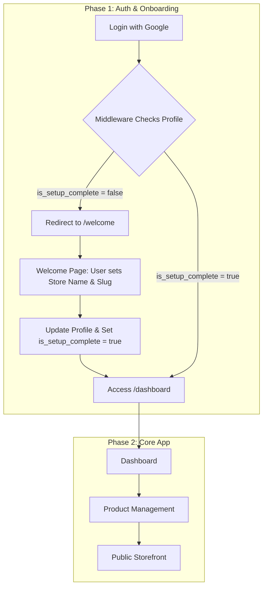

# StoreGenie AI - Development Plan

This document outlines the development plan for the StoreGenie AI MVP. It serves as our single source of truth for the project's tasks and progress.

## High-Level Architecture

We will build a multi-tenant application using a route-based approach with Next.js and Supabase. The core of the application is an AI-powered product creation process and a simple, effective onboarding flow.



## Database Schema

Here are the SQL schemas for the main tables in the Supabase database.

### `profiles`

```sql
CREATE TABLE public.profiles (
    id uuid NOT NULL PRIMARY KEY REFERENCES auth.users(id) ON DELETE CASCADE,
    email text,
    store_name text,
    store_slug text,
    is_setup_complete boolean DEFAULT false
);
```

### `products`

```sql
CREATE TABLE public.products (
    id bigint GENERATED BY DEFAULT AS IDENTITY PRIMARY KEY,
    user_id uuid NOT NULL REFERENCES auth.users(id),
    profile_id uuid NOT NULL REFERENCES public.profiles(id),
    title text NOT NULL,
    description text,
    tags text,
    stock integer NOT NULL DEFAULT 0,
    image text,
    created_at timestamp with time zone DEFAULT timezone('utc'::text, now()) NOT NULL
);
```

### `product_images`

```sql
CREATE TABLE public.product_images (
    id UUID PRIMARY KEY DEFAULT uuid_generate_v4(),
    product_id BIGINT NOT NULL REFERENCES public.products(id) ON DELETE CASCADE,
    image_path TEXT NOT NULL,
    created_at TIMESTAMPTZ NOT NULL DEFAULT NOW()
);
```

### `carts`

```sql
CREATE TABLE public.carts (
    id uuid NOT NULL PRIMARY KEY DEFAULT uuid_generate_v4(),
    user_id uuid NULL UNIQUE REFERENCES auth.users(id),
    session_id text NULL UNIQUE,
    created_at timestamp with time zone DEFAULT timezone('utc'::text, now()) NOT NULL
);
```

### `cart_items`

```sql
CREATE TABLE public.cart_items (
    id bigint GENERATED BY DEFAULT AS IDENTITY PRIMARY KEY,
    cart_id uuid NOT NULL REFERENCES public.carts(id) ON DELETE CASCADE,
    product_id bigint NOT NULL REFERENCES public.products(id) ON DELETE CASCADE,
    quantity integer NOT NULL DEFAULT 1,
    created_at timestamp with time zone DEFAULT timezone('utc'::text, now()) NOT NULL
);
```

## Task Checklist

### MVP
- [ ] **Cart:** Implement cart functionality
- [x] **Auth:** Implement Google OAuth Login
- [x] **Test:** Verify Google Login flow and dashboard access
- [x] **DB:** Design and create the `profiles` table in Supabase
- [x] **DB:** Create a Supabase trigger to auto-create a profile on user signup
- [x] **Auth:** Create middleware to protect `/dashboard` and its sub-routes
- [x] **Test:** Write a test to verify middleware is protecting routes
- [x] **DB:** Add `is_setup_complete` flag to `profiles` table
- [x] **Auth:** Update middleware to redirect new users to `/welcome`
- [x] **Onboarding:** Create the `/welcome` page with a setup form
- [x] **Onboarding:** Create an API endpoint to update the user's profile
- [x] **Test:** Write a test to verify the onboarding flow
- [x] **Dashboard:** Create a basic authenticated dashboard page
- [x] **DB:** Create the `products` table
- [x] **Products:** Create product upload form at `/dashboard/products/new`
- [x] **Products:** Configure Supabase Storage for product images
- [x] **Products:** Build `POST /api/products` endpoint
- [ ] **AI:** Enhance Gemini prompt to include `customization_possible` flag
- [ ] **Test:** Write a test for the product creation API
- [x] **Storefront:** Develop the dynamic public-facing store page at `/[artistStore]`
- [x] **Storefront:** Develop the dynamic public-facing product page at `/[artistStore]/[productId]`
- [ ] **Storefront:** Display customization options on the product page
- [ ] **Storefront:** Implement "Request Customization" feature with an API endpoint
- [ ] **Test:** Write a test for the custom request API
- [ ] **Analytics:** Create the `/dashboard/analytics` page

### Stretch Goals (Post-Hackathon)
- **Duplicate Detection:** Implement perceptual hashing to detect and merge similar products.
- **Dynamic Product Forms:** Create category-specific forms (e.g., for skincare, clothing).
- **AI Ingredient Scanner:** Allow users to scan ingredient labels to auto-populate fields.
