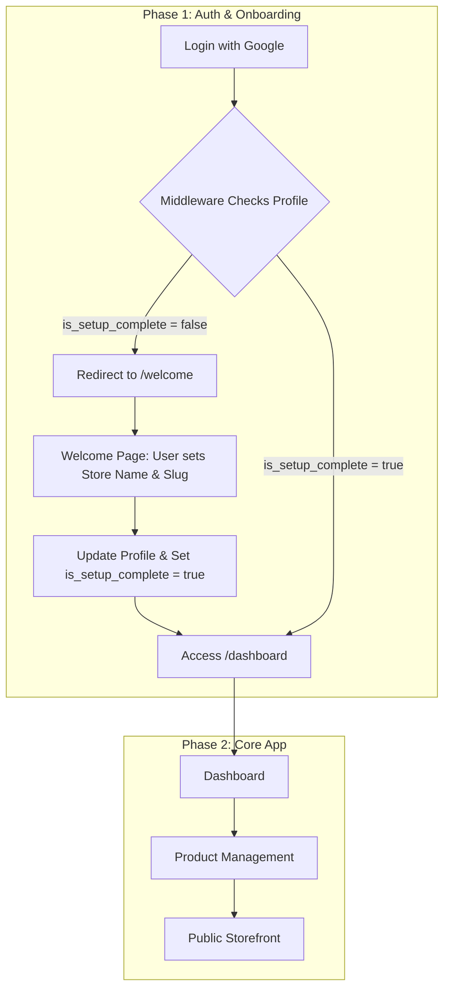

# StoreGenie AI - Development Plan

This document outlines the development plan for the StoreGenie AI MVP. It serves as our single source of truth for the project's tasks and progress.

## High-Level Architecture

We will build a multi-tenant application using a route-based approach with Next.js and Supabase. The core of the application is an AI-powered product creation process and a simple, effective onboarding flow.

## Task Checklist

### MVP
- [x] **Auth:** Implement Google OAuth Login
- [x] **Test:** Verify Google Login flow and dashboard access
- [x] **DB:** Design and create the `profiles` table in Supabase
- [x] **DB:** Create a Supabase trigger to auto-create a profile on user signup
- [x] **Auth:** Create middleware to protect `/dashboard` and its sub-routes
- [x] **Test:** Write a test to verify middleware is protecting routes
- [x] **DB:** Add `is_setup_complete` flag to `profiles` table
- [x] **Auth:** Update middleware to redirect new users to `/welcome`
- [x] **Onboarding:** Create the `/welcome` page with a setup form
- [x] **Onboarding:** Create an API endpoint to update the user's profile
- [x] **Test:** Write a test to verify the onboarding flow
- [x] **Dashboard:** Create a basic authenticated dashboard page
- [ ] **DB:** Create the `products` table with `customization_possible`
- [x] **Products:** Create product upload form at `/dashboard/products/new`
- [x] **Products:** Configure Supabase Storage for product images
- [ ] **AI:** Enhance Gemini prompt to include `customization_possible` flag
- [ ] **Products:** Build `POST /api/products` endpoint
- [ ] **Test:** Write a test for the product creation API
- [ ] **Storefront:** Develop the dynamic public-facing store page at `/[artistStore]`
- [ ] **Storefront:** Develop the dynamic public-facing product page at `/[artistStore]/[productId]`
- [ ] **Storefront:** Display customization options on the product page
- [ ] **Storefront:** Implement "Request Customization" feature with an API endpoint
- [ ] **Test:** Write a test for the custom request API
- [ ] **Analytics:** Create the `/dashboard/analytics` page

### Stretch Goals (Post-Hackathon)
- **Duplicate Detection:** Implement perceptual hashing to detect and merge similar products.
- **Dynamic Product Forms:** Create category-specific forms (e.g., for skincare, clothing).
- **AI Ingredient Scanner:** Allow users to scan ingredient labels to auto-populate fields.
