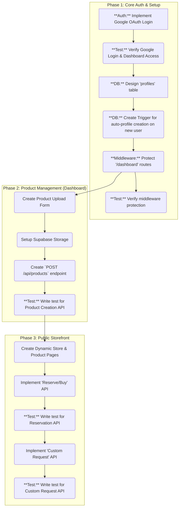

# StoreGenie AI - Development Plan

This document outlines the development plan for the StoreGenie AI MVP. It serves as our single source of truth for the project's tasks and progress.

## High-Level Architecture

We will build a multi-tenant application using Next.js and Supabase. Each artist will have their own unique storefront URL. We will implement a testing strategy focused on API routes to ensure backend stability.

## Task Checklist

- [x] **Auth:** Implement Google OAuth Login
- [x] **Test:** Verify Google Login flow and dashboard access
- [x] **DB:** Design and create the `profiles` table in Supabase
- [x] **DB:** Create a Supabase trigger to auto-create a profile on user signup
- [x] **Auth:** Create middleware to protect `/dashboard` and its sub-routes
- [x] **Test:** Write a test to verify middleware is protecting routes
- [x] **Dashboard:** Create a basic authenticated dashboard page
- [x] **Products:** Create product upload form at `/dashboard/products/new`
- [x] **Products:** Configure Supabase Storage for product images
- [ ] **Products:** Build `POST /api/products` endpoint
- [ ] **Test:** Write a test for the product creation API
- [ ] **Storefront:** Develop the dynamic public-facing store page at `/[artistStore]`
- [ ] **Storefront:** Develop the dynamic public-facing product page at `/[artistStore]/[productId]`
- [ ] **Storefront:** Implement "Reserve/Buy" feature with an API endpoint
- [ ] **Test:** Write a test for the reservation API
- [ ] **Storefront:** Implement "Custom Request" feature with an API endpoint
- [ ] **Test:** Write a test for the custom request API
- [ ] **Analytics:** Create the `/dashboard/analytics` page
